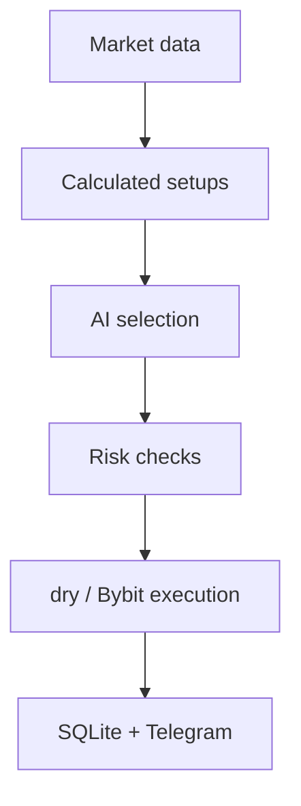

# Crypto Trading Bot for Bybit

[Русский](README.md) · [English](README_EN.md)

Telegram-панель управления Bybit Unified Account: позиции, история сделок, графики и алерты. DeepSeek выбирает из рассчитанных кодом торговых вариантов; риск и исполнение контролирует код. По умолчанию включён режим `dry` без отправки торговых запросов.

## Быстрый старт

Требуется Python 3.14+.

```powershell
git clone https://github.com/soroka01/TgBot-Bybot-control.git
cd TgBot-Bybot-control
py -3 -m venv .venv
.\.venv\Scripts\Activate.ps1
python -m pip install -r requirements.txt
Copy-Item .env.example .env
```

`start.bat` создаёт `.venv` при необходимости, устанавливает отсутствующие зависимости и запускает Telegram UI. Для console mode используйте команды из раздела «Запуск».

## Как это работает



## Экраны

| Экран | Содержимое | Обновление |
| --- | --- | --- |
| 📊 Позиции | Позиции, PnL, ROI, TP/SL, подтверждённое закрытие | 8с |
| 💰 Баланс | Wallet, equity, margin, available balance | 10с |
| 📈 Живой график | Свечи, EMA20/50, объём, live price и 14D low | 30с |
| 🔍 Рынок | Цена, 24h change, режим, RSI и spread | 15с |
| 🧠 AI-сетапы | Read-only выбор и полный deterministic trade plan | По запросу |
| 🤖 Авто | Lifecycle, режим, лимиты, последний цикл и ошибка | 5с |
| 🔔 Алерты | Price/RSI crossing, once/repeat | 15с scheduler |
| 🧾 События | Личный activity log | По запросу |
| 📜 Сделки | PnL-кривая, статистика и последние сделки за 1Д–1ГОД | По запросу + sync 15м |

Торговые, account и AI callback доступны только ID из `ADMIN_TELEGRAM_IDS`. Групповые чаты блокируются. Сохранённый `is_admin` в SQLite не является источником авторизации.

### История и статистика сделок

- Периоды — скользящие `24/7/14/30/90/180/365` суток; можно переключить сделки бота и весь USDT linear account.
- Bybit Closed PnL загружается всеми cursor-страницами в окнах не шире 7 дней. Auto-loop обновляет последние 7 дней раз в 15 минут, а экран при необходимости достраивает локальную историю до выбранного периода.
- `closedPnl` считается авторитетным net PnL: Bybit уже включил торговые комиссии и funding. `openFee`/`closeFee` сохраняются как расшифровка и повторно не вычитаются.
- Частичные закрытия одного bot candidate объединяются в одну логическую сделку; внешние и ручные закрытия аккаунта остаются отдельными exchange records.
- В audit-layer рассчитываются net/gross PnL, W/L/BE, win rate, profit factor, expectancy, median, средняя прибыль/потеря, payoff, drawdown/recovery, серии, комиссии, оборот, удержание, R/SQN, Long/Short и статистика инструментов. Telegram оставляет компактный срез и последние пять сделок; метрика появляется только при достаточных данных.
- В SQLite остаются исходная запись Bybit, точный локальный план, snapshot, решение селектора и sizing context. Это позволяет позднее аудитировать результат без перегрузки Telegram-экрана.
- Изменение equity и account-level drawdown в процентах строятся только по накопленным equity snapshots. Они не корректируются на ввод/вывод средств, поэтому для оценки стратегии основным остаётся Closed PnL. Sharpe/Sortino намеренно не показываются без достаточной корректной дневной equity-кривой.
- Для UTA 2.0 isolated margin документированно пустые account-wide margin/available fields не считаются ошибкой equity-snapshot: optional available вычисляется из USDT coin fields, а нулевой equity спокойно пропускается. Строгая проверка торгового контура при этом не ослабляется.

## Настройки

`config.py` загружает локальный `.env`, но уже заданные process environment variables имеют приоритет. `.env`, ключи, SQLite, журналы и DeepSeek logs игнорируются Git.

Минимальный безопасный `.env`:

```dotenv
TELEGRAM_TOKEN=...
ADMIN_TELEGRAM_IDS=123456789

BYBIT_API_KEY=...
BYBIT_API_SECRET=...
BYBIT_ENV=testnet
TRADING_MODE=dry

DEEPSEEK_API_KEY=...
DEEPSEEK_MODEL=deepseek-v4-flash
```

### Режимы

| Переменная | Значения | Смысл |
| --- | --- | --- |
| `BYBIT_ENV` | `testnet`, `demo`, `mainnet` | Выбирает только официальный API host |
| `TRADING_MODE` | `dry`, `live` | `dry` блокирует все изменяющие Bybit requests |
| `LIVE_TRADING_CONFIRMATION` | точная фраза | Дополнительный interlock для `live` |

Для реального исполнения нужны одновременно:

```dotenv
BYBIT_ENV=mainnet
TRADING_MODE=live
LIVE_TRADING_CONFIRMATION=I_ACCEPT_LIVE_TRADING_RISK
```

Опечатка в mode не включает LIVE: startup завершается с ошибкой. Старый `DRY_RUN` поддерживается только как migration fallback; для новой конфигурации используйте `TRADING_MODE`.

`dry` — preview без выдуманного paper PnL: GET остаются реальными, но POST не отправляются. Решение и рассчитанный план сохраняются для аудита, однако не входят в статистику реальных сделок. Для проверки настоящих fills и состояния позиций используйте отдельный Bybit Demo/Testnet account, а не mainnet key.

### Основные лимиты

| Переменная | Default | Назначение |
| --- | ---: | --- |
| `TRADABLE_TOKENS` | `BTC,ETH,SOL,XRP,BNB,DOGE` | Разрешённые USDT linear assets |
| `POLL_INTERVAL` | `180` | Пауза auto-loop, секунд |
| `MAX_RISK_PER_TRADE_PERCENT` | `1` | Максимальный риск сделки от equity |
| `MAX_TOTAL_RISK_PERCENT` | `5` | Максимальный риск портфеля |
| `MAX_DAILY_LOSS_PERCENT` | `3` | Закрытый realized loss и account-scoped UTC equity drawdown от high-water |
| `MAX_POSITION_NOTIONAL_PERCENT` | `100` | Верхняя граница notional от equity |
| `AUTO_LEVERAGE` | `2` | Верхняя граница автоматически выбранного плеча |
| `MIN_NET_RISK_REWARD_RATIO` | `1.5` | Минимальный R/R после издержек |
| `MAX_SPREAD_PERCENT` | `0.15` | Запрет входа при широком spread |
| `MAX_PRICE_DRIFT_PERCENT` | `0.25` | Допустимый уход цены после snapshot |
| `BYBIT_MAX_SLIPPAGE_PERCENT` | `0.30` | Жёсткая граница цены IOC-entry и reduce-only exit |
| `SIGNAL_VALIDITY_SECONDS` | `90` | TTL AI-решения |

Полный перечень с безопасными defaults находится в [.env.example](.env.example).

## Запуск

```powershell
python main.py telegram
python main.py auto
python main.py
```

Перед запуском `auto` проверяются ключи, model ID, режим и bounds. В Telegram LIVE дополнительно требует отдельного подтверждения на экране.

## Локальные данные

| Путь | Данные |
| --- | --- |
| `data/crypto_bot.sqlite3` | Планы входа, raw Closed PnL, sync watermarks, equity snapshots, профили, экраны, алерты, outbox и activity |
| `crypto_bot.log` | Rotating журнал, retention 10 дней |
| `api/deepseek_logs/` | Только при `DEEPSEEK_LOG_RESPONSES=true` |

DeepSeek response logging выключен по умолчанию. При включении сохраняются только model, `snapshot_id` и финальный JSON — не raw wallet context и не reasoning.

Trade journal привязан к official Bybit environment и числовому account UID. API key/secret и полный ответ `/v5/user/query-api` в БД не сохраняются; для доступа к проверенному offline-кэшу остаётся только односторонний SHA-256 fingerprint ключа. SQLite-файл содержит чувствительную торговую историю: не публикуйте его и включите в резервное копирование.

Используйте Bybit API key только с read/trade permissions и **без withdrawal permission**.

## Ограничения

- Поддерживаются `linear` USDT contracts и один процесс/один Unified Account; авто-вход требует `REGULAR_MARGIN`.
- SQLite не координирует несколько одновременно запущенных экземпляров приложения.
- Первичная статистика ограничена доступным Bybit Closed PnL и локально накопленными snapshots; бот загружает максимум выбранный год, после чего записи локально не удаляет.
- Auto-mode намеренно консервативен и может долго не находить сетапов.
- Telegram edit существующего сообщения обычно не создаёт полноценное push-уведомление. Алерты здесь — durable in-app banners, но не канал для событий, которые нельзя пропустить.
- CoinGecko, Telegram, DeepSeek и Bybit могут быть недоступны или менять rate limits.
- Ни один фильтр не гарантирует прибыль и не устраняет рыночный риск.

## Лицензия

[MIT](LICENSE).

## Поддержка

Можно [форкнуть репозиторий](https://github.com/soroka01/TgBot-Bybot-control/fork) и доработать под себя. Если проект пригодился, поставьте [Star](https://github.com/soroka01/TgBot-Bybot-control) — так я увижу, что он был кому-то полезен.

---

with love ❤️
