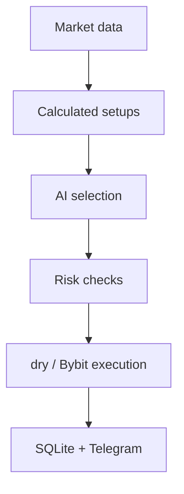

# 🤖 Crypto Trading Bot for Bybit

> A Telegram control panel for a Bybit Unified Account with AI setup selection and strict code-level risk control.

🌐 **Язык / Language:** [Русский](README.md) · [English](README_EN.md)


## 📌 Overview

The bot shows positions, trade history, charts, and alerts for a Bybit Unified Account in Telegram. DeepSeek selects from trade setups calculated by code; code controls risk and execution. The default `dry` mode sends no mutating trading requests.

> [!WARNING]
> No filter guarantees profit or removes market risk. `live` mode sends real orders.

## ✨ Features

- 📊 Positions with PnL, ROI, TP/SL, and confirmed close; balance (wallet, equity, margin).
- 📈 Live chart (candles, EMA20/50, volume) and market overview (price, 24h change, regime, RSI, spread).
- 🧠 AI setups: read-only selection and a full deterministic trade plan.
- 🤖 Auto mode with risk limits, execution gates, and position protection.
- 🔔 Price and RSI alerts (once/repeat) and a personal activity log.
- 📜 Trade history and statistics over 1D–1Y based on Bybit Closed PnL.
- 🛡️ `dry` / `live` modes with a separate confirmation for real execution.

## 🏗️ How it works



## 🚀 Quick start

### Requirements

- Python 3.14+
- A Telegram bot (token from @BotFather) and your numeric Telegram ID
- A Bybit API key (Read + Contract Trading, **no withdrawal permission**)
- A DeepSeek API key

### Installation

```powershell
git clone https://github.com/soroka01/TgBot-Bybot-control.git
cd TgBot-Bybot-control
py -3 -m venv .venv
.\.venv\Scripts\Activate.ps1
python -m pip install -r requirements.txt
Copy-Item .env.example .env
```

### Configuration

Minimal safe `.env`:

```dotenv
TELEGRAM_TOKEN=...
ADMIN_TELEGRAM_IDS=123456789

BYBIT_API_KEY=...
BYBIT_API_SECRET=...
BYBIT_ENV=testnet
TRADING_MODE=dry

DEEPSEEK_API_KEY=...
DEEPSEEK_MODEL=deepseek-v4-flash
```

### Run

```powershell
python main.py telegram   # Telegram UI
python main.py auto       # auto mode in the console
python main.py            # interactive mode selection
```

`start.bat` creates `.venv` when needed, installs missing dependencies, and launches the Telegram UI. Before startup the application validates keys, model ID, mode, and bounds. In Telegram, LIVE additionally requires an in-screen confirmation.

## ⚙️ Configuration

`config.py` loads a local `.env`, while existing process environment variables take precedence. See [.env.example](.env.example) for the complete list with safe defaults.

### Modes

| Variable | Values | Description |
| --- | --- | --- |
| `BYBIT_ENV` | `testnet`, `demo`, `mainnet` | Selects an allow-listed official API host |
| `TRADING_MODE` | `dry`, `live` | `dry` blocks every mutating Bybit request |
| `LIVE_TRADING_CONFIRMATION` | exact phrase | Additional interlock for `live` |

Real execution requires all three:

```dotenv
BYBIT_ENV=mainnet
TRADING_MODE=live
LIVE_TRADING_CONFIRMATION=I_ACCEPT_LIVE_TRADING_RISK
```

A typo cannot enable LIVE; startup fails instead. Legacy `DRY_RUN` is accepted only as a migration fallback; new configurations should use `TRADING_MODE`.

`dry` is a preview without fabricated paper PnL: GET requests are real but POST requests are blocked. The decision and calculated plan are kept for auditing but excluded from real-trade statistics. Use a separate Bybit Demo/Testnet account to verify actual fills, never a mainnet key.

### Main limits

| Variable | Default | Description |
| --- | ---: | --- |
| `TRADABLE_TOKENS` | `BTC,ETH,SOL,XRP,BNB,DOGE` | Allowed USDT linear assets |
| `POLL_INTERVAL` | `180` | Auto-loop delay in seconds |
| `MAX_RISK_PER_TRADE_PERCENT` | `1` | Maximum trade risk as a percentage of equity |
| `MAX_TOTAL_RISK_PERCENT` | `5` | Maximum portfolio risk |
| `MAX_DAILY_LOSS_PERCENT` | `3` | Closed realized loss and account-scoped UTC equity drawdown from its high-water mark |
| `MAX_POSITION_NOTIONAL_PERCENT` | `100` | Maximum notional relative to equity |
| `AUTO_LEVERAGE` | `2` | Cap for automatically selected leverage |
| `MIN_NET_RISK_REWARD_RATIO` | `1.5` | Minimum R/R after costs |
| `MAX_SPREAD_PERCENT` | `0.15` | Reject entries when the spread is wide |
| `MAX_PRICE_DRIFT_PERCENT` | `0.25` | Maximum price movement after the snapshot |
| `BYBIT_MAX_SLIPPAGE_PERCENT` | `0.30` | Hard price boundary for IOC entries and reduce-only exits |
| `SIGNAL_VALIDITY_SECONDS` | `90` | AI decision TTL |

### Telegram screens

| Screen | Content | Refresh |
| --- | --- | --- |
| 📊 Positions | Positions, PnL, ROI, TP/SL, confirmed close | 8s |
| 💰 Balance | Wallet, equity, margin, available balance | 10s |
| 📈 Live chart | Candles, EMA20/50, volume, live price, and 14D low | 30s |
| 🔍 Market | Price, 24h change, regime, RSI, and spread | 15s |
| 🧠 AI setups | Read-only selection and deterministic trade plan | On request |
| 🤖 Auto | Lifecycle, mode, limits, last cycle, and error | 5s |
| 🔔 Alerts | Price/RSI crossing, once/repeat | 15s scheduler |
| 🧾 Activity | Personal activity log | On request |
| 📜 Trades | PnL curve, statistics, and recent trades over 1D–1Y | On request + 15m sync |

### Trade history and statistics

- Periods are rolling `24/7/14/30/90/180/365` days, with a switch between bot-attributed trades and the complete linear USDT account.
- Bybit Closed PnL is fetched through every cursor page in windows no wider than seven days. The auto loop refreshes the latest seven days every 15 minutes, and the screen backfills the selected period on demand.
- `closedPnl` is the authoritative net PnL: Bybit already includes fees and funding. `openFee`/`closeFee` are kept as a cost breakdown and never subtracted twice.
- Partial closes attributed to one bot candidate are grouped into one trade; external and manual closes remain individual exchange records.
- Calculated: net/gross PnL, W/L/BE, win rate, profit factor, expectancy, median, payoff, drawdown/recovery, streaks, fees, turnover, hold time, R/SQN, Long/Short, and per-symbol statistics. Telegram shows a compact subset plus five recent trades; a metric appears only when enough data exists.
- SQLite retains the original Bybit record, local plan, snapshot, selector decision, and sizing context for later auditing.
- Equity change and drawdown percentages are built only from accumulated equity snapshots and are not cash-flow adjusted, so Closed PnL remains the primary measure. Sharpe/Sortino are omitted without a sufficient daily equity curve.
- In UTA 2.0 isolated margin, empty account-wide margin/available fields are not treated as an equity-snapshot error: available balance is derived from USDT coin fields and zero equity is skipped. The strict trading-path check is not relaxed.

## 🗂️ Project structure

```text
.
├── main.py              # Entry point: telegram / auto / interactive menu
├── config.py            # Loads and validates settings from .env
├── start.bat            # Windows launcher (venv, dependencies, Telegram UI)
├── .env.example         # Configuration template without secrets
├── requirements.txt     # Dependencies
├── api/                 # Bybit, DeepSeek, and Telegram notification clients
├── core/                # Market data, setups, risk, alerts, trade analytics
│   └── auto/            # Auto mode: loop, gates, execution, position protection
├── storage/             # SQLite storage
├── telegram_bot/        # aiogram: handlers, keyboards, UI screens
├── tools/               # Helper scripts (backtest, history download)
├── utils/               # Logger and helpers
└── data/                # Local database (created at runtime, not in Git)
```

## 🔒 Security & privacy

- Trading, account, and AI callbacks are restricted to IDs in `ADMIN_TELEGRAM_IDS`; group chats are blocked. Persisted SQLite `is_admin` is never an authorization source.
- Use a Bybit API key with read/trade permissions and **without withdrawal permission**.
- `.env`, keys, SQLite, runtime logs, and DeepSeek logs are ignored by Git.
- DeepSeek response logging is disabled by default (`DEEPSEEK_LOG_RESPONSES`); when enabled, only the model, `snapshot_id`, and final JSON are persisted, not raw wallet context or reasoning.
- The trade journal is scoped by the official Bybit environment and numeric account UID. API key/secret and the full `/v5/user/query-api` response are never stored; only a one-way SHA-256 key fingerprint remains.
- The SQLite file contains sensitive trading history: do not publish it, and include it in backups.

| Path | Data |
| --- | --- |
| `data/crypto_bot.sqlite3` | Entry plans, raw Closed PnL, sync watermarks, equity snapshots, profiles, screens, alerts, outbox, and activity |
| `crypto_bot.log` | Rotating runtime log with 10-day retention |
| `api/deepseek_logs/` | Only when `DEEPSEEK_LOG_RESPONSES=true` |

## ⚠️ Limitations

- Supports linear USDT contracts and one process/one Unified Account; automated entries require `REGULAR_MARGIN`.
- SQLite does not coordinate multiple simultaneously running application instances.
- Statistics are limited by available Bybit Closed PnL and locally accumulated snapshots; the bot backfills at most the selected year and does not later delete those records.
- Auto mode is deliberately conservative and may find no setup for long periods.
- Editing an existing Telegram message usually does not produce a push notification: alerts are durable in-app banners, not a must-not-miss channel.
- CoinGecko, Telegram, DeepSeek, and Bybit may be unavailable or change rate limits.

## 📄 License

[MIT](LICENSE).

## 💬 Support

Feel free to [fork this repository](https://github.com/soroka01/TgBot-Bybot-control/fork) and adapt it. If it helped you, leave a [Star](https://github.com/soroka01/TgBot-Bybot-control) so I can see it was useful.

---

with love ❤️
