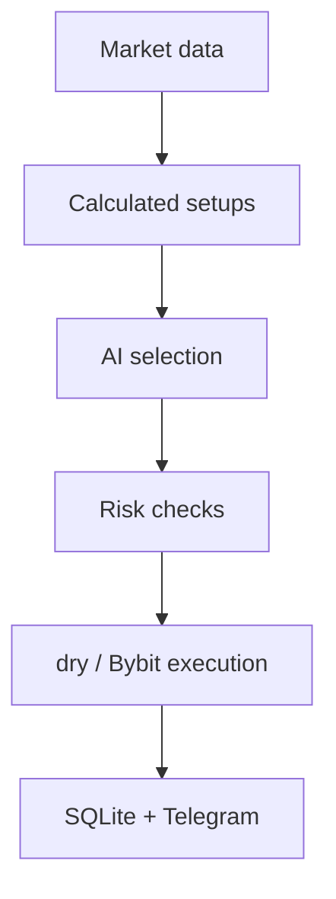

# Crypto Trading Bot for Bybit

[Русский](README.md) · [English](README_EN.md)

Telegram panel for a Bybit Unified Account: positions, trade history, charts, and alerts. DeepSeek selects from setups calculated by code; code controls risk and execution. The default `dry` mode sends no trading requests.

## Quick start

Requires Python 3.14+.

```powershell
git clone https://github.com/soroka01/TgBot-Bybot-control.git
cd TgBot-Bybot-control
py -3 -m venv .venv
.\.venv\Scripts\Activate.ps1
python -m pip install -r requirements.txt
Copy-Item .env.example .env
```

`start.bat` creates `.venv` when needed, installs missing dependencies, and launches the Telegram UI. Use the commands in “Running” for console modes.

## How it works



## Screens

| Screen | Content | Refresh |
| --- | --- | --- |
| 📊 Positions | Positions, PnL, ROI, TP/SL, confirmed close | 8s |
| 💰 Balance | Wallet, equity, margin, available balance | 10s |
| 📈 Live chart | Candles, EMA20/50, volume, live price, and 14D low | 30s |
| 🔍 Market | Price, 24h change, regime, RSI, and spread | 15s |
| 🧠 AI setups | Read-only selection and deterministic trade plan | On request |
| 🤖 Auto | Lifecycle, mode, limits, last cycle, and error | 5s |
| 🔔 Alerts | Price/RSI crossing, once/repeat | 15s scheduler |
| 🧾 Activity | Personal activity log | On request |
| 📜 Trades | PnL curve, statistics, and recent trades over 1D–1Y | On request + 15m sync |

Trading, account, and AI callbacks are restricted to IDs in `ADMIN_TELEGRAM_IDS`. Group chats are blocked. Persisted SQLite `is_admin` is never an authorization source.

### Trade history and statistics

- Periods are rolling `24/7/14/30/90/180/365` days, with a switch between bot-attributed trades and the complete linear USDT account.
- Bybit Closed PnL is fetched through every cursor page in windows no wider than seven days. The auto loop refreshes the latest seven days every 15 minutes, while the screen backfills the selected period on demand.
- `closedPnl` is the authoritative net PnL: Bybit already includes trading fees and funding. `openFee`/`closeFee` are retained as a cost breakdown and are never subtracted twice.
- Partial closes attributed to one bot candidate are grouped into one logical trade. External and manual account closes remain individual exchange records.
- The audit layer calculates net/gross PnL, W/L/BE, win rate, profit factor, expectancy, median, average win/loss, payoff, drawdown/recovery, streaks, fees, turnover, hold time, R/SQN, Long/Short, and per-symbol statistics. Telegram keeps a compact subset plus five recent trades, and exposes a metric only when enough data exists.
- SQLite retains the original Bybit record, exact local plan, snapshot, selector decision, and sizing context for later auditing without overloading Telegram.
- Equity change and account-level drawdown percentages appear only after equity snapshots exist. They are not cash-flow adjusted, so Closed PnL remains the primary strategy measure. Sharpe/Sortino are intentionally omitted without a sufficient, correctly sampled daily equity curve.
- In UTA 2.0 isolated margin, documented empty account-wide margin/available fields are not treated as an equity-snapshot error: optional available balance is derived from USDT coin fields, while zero equity is skipped cleanly. The strict trading-path parser remains unchanged.

## Configuration

`config.py` loads a local `.env`, while existing process environment variables take precedence. `.env`, keys, SQLite, runtime logs, and DeepSeek logs are ignored by Git.

Minimal safe `.env`:

```dotenv
TELEGRAM_TOKEN=...
ADMIN_TELEGRAM_IDS=123456789

BYBIT_API_KEY=...
BYBIT_API_SECRET=...
BYBIT_ENV=testnet
TRADING_MODE=dry

DEEPSEEK_API_KEY=...
DEEPSEEK_MODEL=deepseek-v4-flash
```

### Modes

| Variable | Values | Meaning |
| --- | --- | --- |
| `BYBIT_ENV` | `testnet`, `demo`, `mainnet` | Selects an allow-listed official API host |
| `TRADING_MODE` | `dry`, `live` | `dry` blocks every mutating Bybit request |
| `LIVE_TRADING_CONFIRMATION` | exact phrase | Additional interlock for `live` |

Real execution requires all three:

```dotenv
BYBIT_ENV=mainnet
TRADING_MODE=live
LIVE_TRADING_CONFIRMATION=I_ACCEPT_LIVE_TRADING_RISK
```

A typo cannot enable LIVE; startup fails instead. Legacy `DRY_RUN` is accepted only as a migration fallback. New configurations should use `TRADING_MODE`.

`dry` is a preview without fabricated paper PnL: GET requests are real but POST requests are blocked. The selector decision and calculated plan are kept for auditing but excluded from real-trade performance. Use a separate Bybit Demo/Testnet account for actual fills and position state, never a mainnet key.

### Main limits

| Variable | Default | Purpose |
| --- | ---: | --- |
| `TRADABLE_TOKENS` | `BTC,ETH,SOL,XRP,BNB,DOGE` | Allowed linear USDT assets |
| `POLL_INTERVAL` | `180` | Auto-loop delay in seconds |
| `MAX_RISK_PER_TRADE_PERCENT` | `1` | Maximum trade risk as equity percentage |
| `MAX_TOTAL_RISK_PERCENT` | `5` | Maximum portfolio risk |
| `MAX_DAILY_LOSS_PERCENT` | `3` | Closed realized loss and account-scoped UTC equity drawdown from its high-water |
| `MAX_POSITION_NOTIONAL_PERCENT` | `100` | Maximum notional relative to equity |
| `AUTO_LEVERAGE` | `2` | Cap for automatically selected leverage |
| `MIN_NET_RISK_REWARD_RATIO` | `1.5` | Minimum R/R after costs |
| `MAX_SPREAD_PERCENT` | `0.15` | Reject entries with a wide spread |
| `MAX_PRICE_DRIFT_PERCENT` | `0.25` | Maximum movement after snapshot |
| `BYBIT_MAX_SLIPPAGE_PERCENT` | `0.30` | Hard price boundary for IOC entries and reduce-only exits |
| `SIGNAL_VALIDITY_SECONDS` | `90` | AI decision TTL |

See [.env.example](.env.example) for the complete safe template.

## Running

```powershell
python main.py telegram
python main.py auto
python main.py
```

Before auto mode starts, the application validates keys, model ID, mode, and bounds. Telegram LIVE mode also requires an in-screen confirmation.

## Runtime data and privacy

| Path | Data |
| --- | --- |
| `data/crypto_bot.sqlite3` | Entry plans, raw Closed PnL, sync watermarks, equity snapshots, profiles, screens, alerts, outbox, and activity |
| `crypto_bot.log` | Rotating runtime log with 10-day retention |
| `api/deepseek_logs/` | Only when `DEEPSEEK_LOG_RESPONSES=true` |

DeepSeek response logging is disabled by default. When enabled, only the model, `snapshot_id`, and final JSON are persisted—not raw wallet context or reasoning.

The trade journal is scoped by the official Bybit environment and numeric account UID. API key/secret and the full `/v5/user/query-api` response are never stored; only a one-way SHA-256 key fingerprint remains for verified offline-cache access. The SQLite file contains sensitive trading history: do not publish it, and include it in backups.

Use a Bybit API key with read/trade permissions and **without withdrawal permission**.

## Limitations

- The bot supports linear USDT contracts and one process/one Unified Account; automated entries require `REGULAR_MARGIN`.
- SQLite does not coordinate multiple simultaneously running application instances.
- Initial statistics are limited by available Bybit Closed PnL and locally accumulated snapshots; the bot backfills at most the selected year and does not later delete those trade records.
- Auto mode is deliberately conservative and may find no setup for long periods.
- Editing an existing Telegram message usually does not produce a full push notification. Alerts are durable in-app banners, not a must-not-miss channel.
- CoinGecko, Telegram, DeepSeek, and Bybit may be unavailable or change rate limits.
- No filter guarantees profit or removes market risk.

## License

[MIT](LICENSE).

## Support

Feel free to [fork this repository](https://github.com/soroka01/TgBot-Bybot-control/fork) and adapt it. If it helped you, leave a [Star](https://github.com/soroka01/TgBot-Bybot-control) so I can see it was useful.

---

with love ❤️
